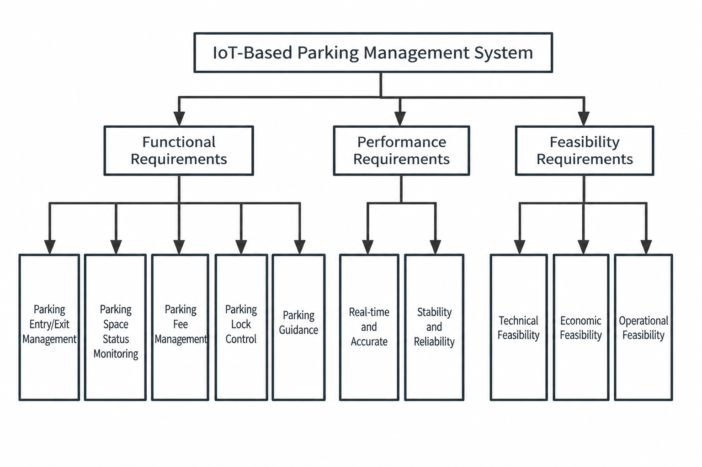
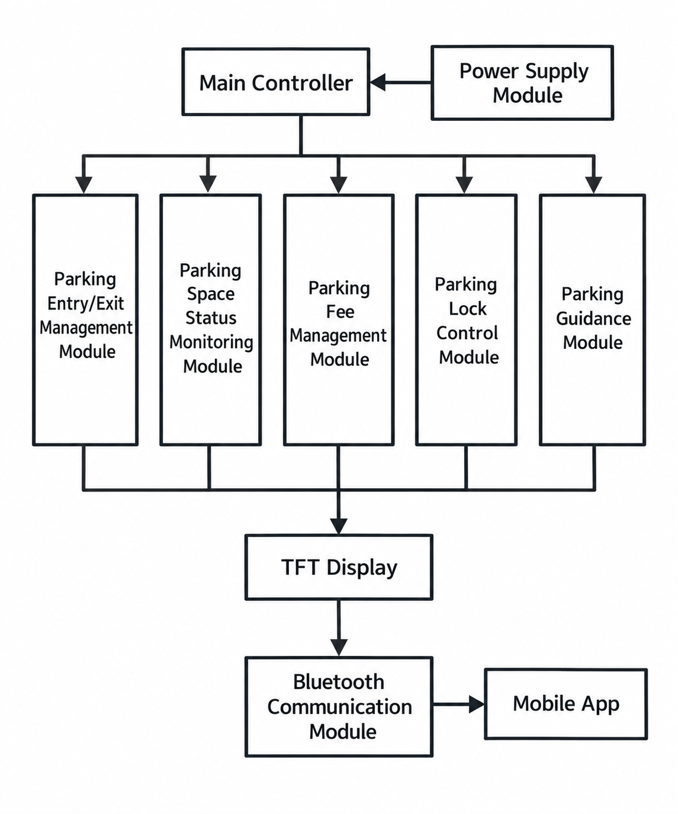
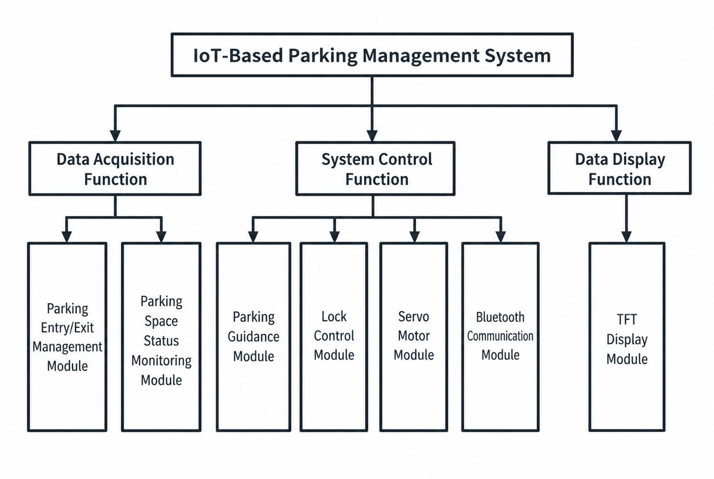
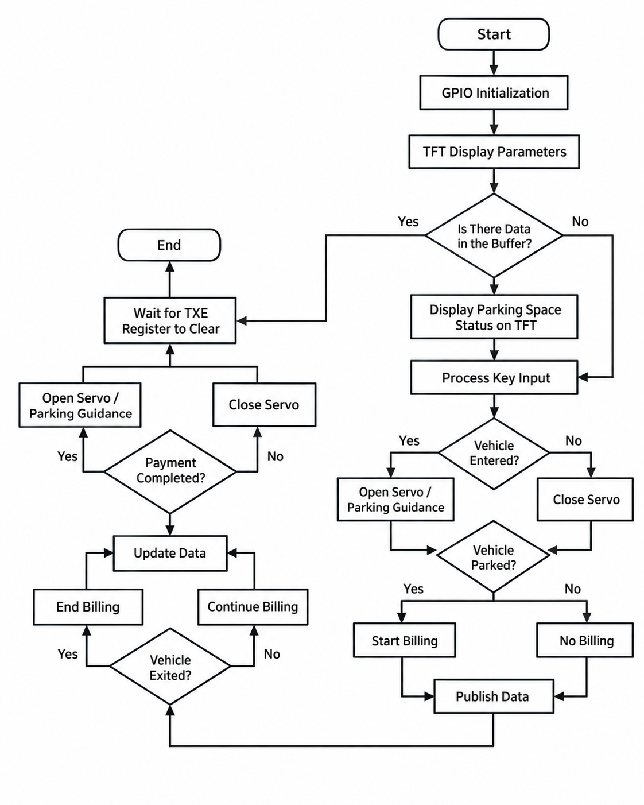
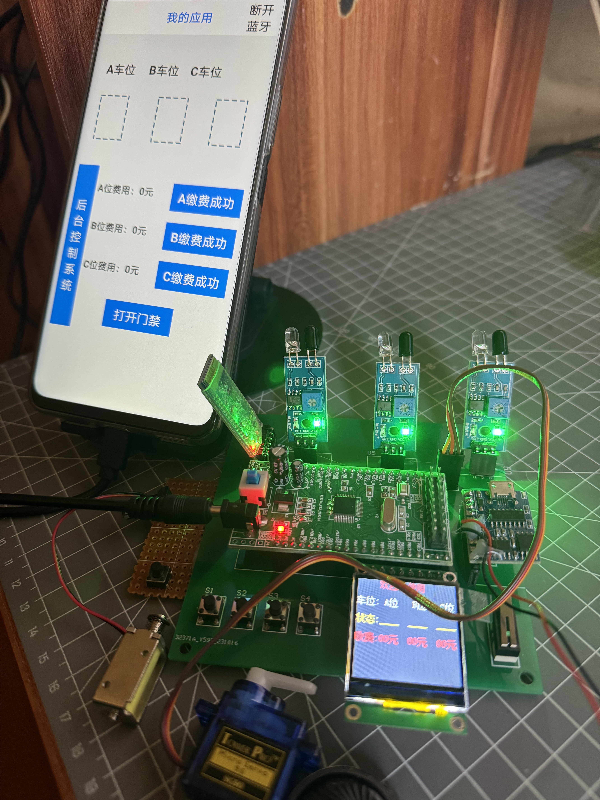
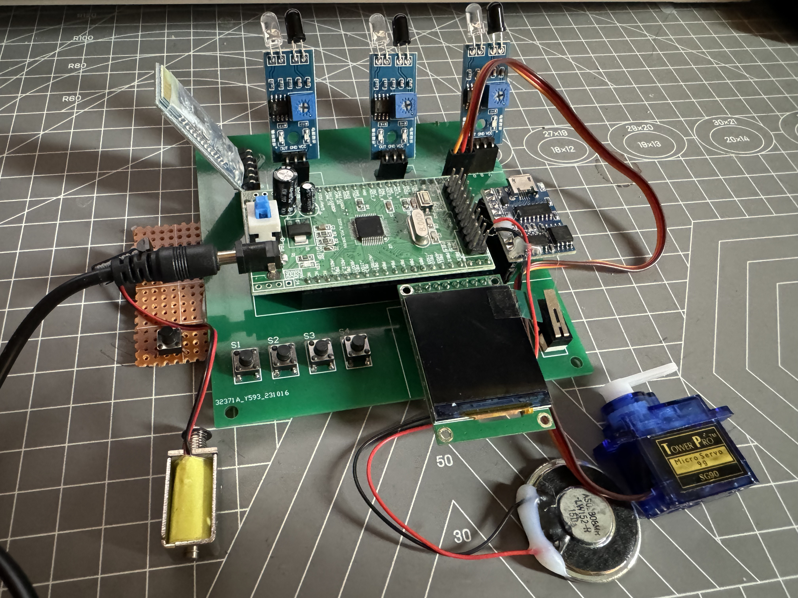
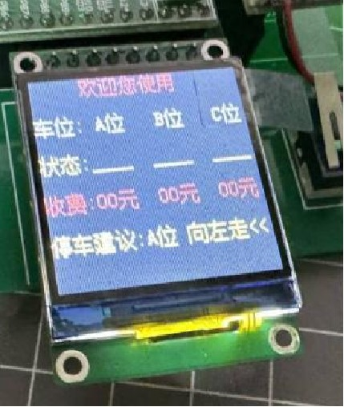
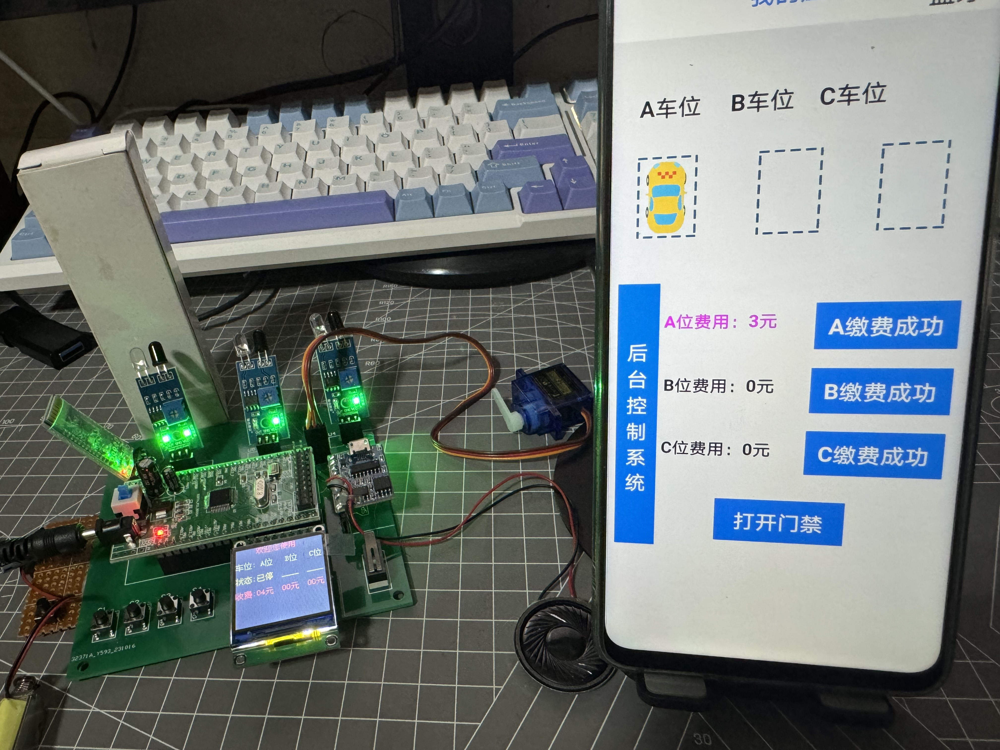
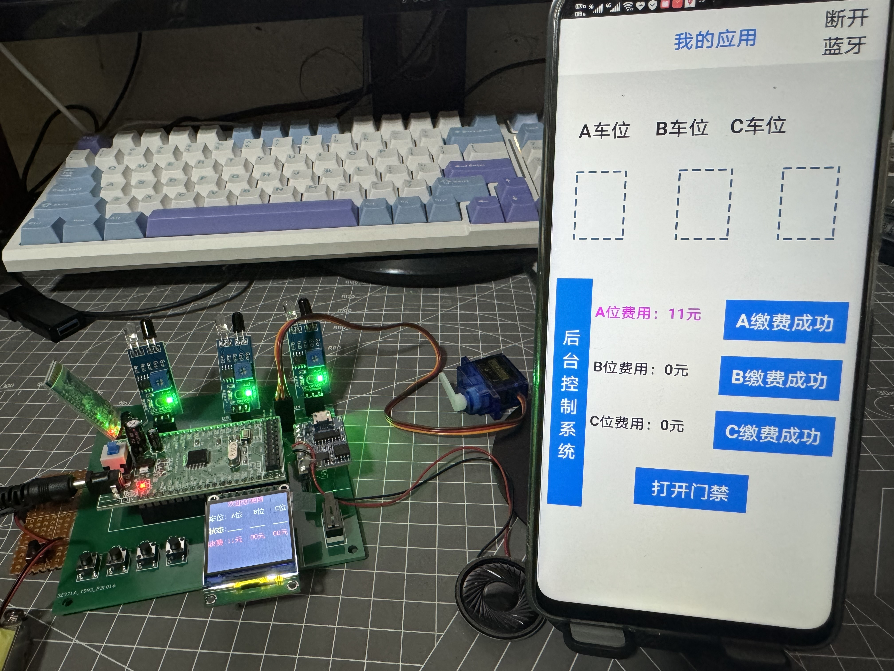
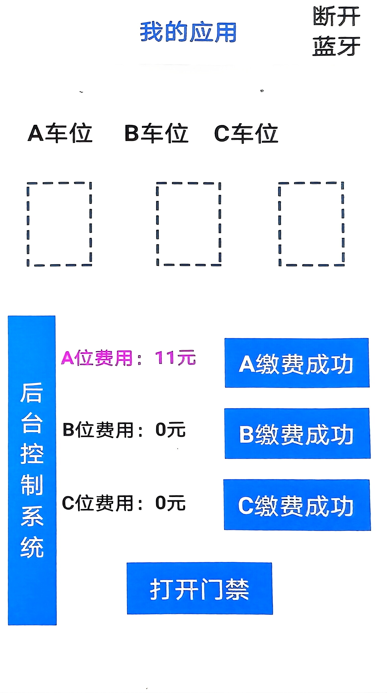

# IoT-Based Parking Management System

An STM32-based IoT parking management system integrating parking-space monitoring, parking guidance, fee calculation, TFT display, servo control, wireless communication, and mobile application interaction.

This project was developed as my **individual Bachelor of Engineering graduation project in Internet of Things Engineering from January to May 2024**. The system combines embedded hardware, sensors, local display, actuator control, and wireless communication into a working parking management prototype.

## Key Features

- Vehicle entry and parking-space occupancy detection
- Monitoring of three parking spaces: A, B, and C
- Automatic parking guidance based on current space availability
- Parking fee calculation based on parking duration
- TFT display for parking status, fees, and guidance information
- Servo-based gate simulation
- Bluetooth communication with a mobile application
- Mobile monitoring of parking-space status and parking fees
- Fee-clearing and gate-control operations through the mobile interface
- Optional ESP8266 / Wi-Fi communication logic in the firmware

## Technical Details

- **Microcontroller:** STM32F103C8T6
- **Programming Language:** Embedded C
- **Primary Wireless Communication:** Bluetooth
- **Optional Wireless Support:** ESP8266 / Wi-Fi logic included in the firmware
- **Mobile Integration:** E4A-based mobile application
- **Display:** TFT colour display
- **Sensors:** Infrared parking-space detection modules
- **Actuation:** Servo motor for gate simulation
- **Audio:** Voice playback module

Bluetooth was used as the primary communication method in the final prototype because it provided more stable operation during testing. ESP8266 / Wi-Fi-related logic was retained in the firmware as an optional communication path.

## System Requirements

The system was designed around three groups of requirements:

- **Functional requirements:** entry/exit management, parking-space monitoring, fee management, parking lock control, and parking guidance
- **Performance requirements:** real-time response, accuracy, stability, and reliability
- **Feasibility requirements:** technical, economic, and operational feasibility



## System Architecture

The system uses a main controller to coordinate the parking entry/exit module, parking-space monitoring, fee management, parking lock control, and parking guidance functions.

A TFT display provides local information, while wireless communication connects the embedded system with the mobile application.



## System Functions

The overall functionality is divided into three main areas:

### Data Acquisition

- Parking entry/exit detection
- Parking-space occupancy monitoring

### System Control

- Parking guidance
- Parking lock control
- Servo motor control
- Bluetooth communication

### Data Display

- TFT display of parking status and system information



## System Workflow

The embedded application continuously processes parking status, sensor input, and user interaction.

The main workflow includes:

1. GPIO and display initialisation
2. Parking-space status monitoring
3. Vehicle-entry detection
4. Servo and parking-guidance control
5. Parking-status confirmation
6. Parking fee calculation
7. Data updates and communication
8. Vehicle-exit and billing completion handling



## Prototype Overview

The prototype monitors three parking spaces (A, B, and C), detects vehicle occupancy, provides parking guidance, calculates parking fees, displays parking information on a TFT screen, and synchronises status information with a mobile application.

The original prototype interface was developed in Chinese. System diagrams and documentation in this repository have been translated into English for clarity, while the original TFT and mobile application interfaces are preserved in the demonstration images.



## Hardware Prototype

The hardware prototype integrates an STM32F103C8T6 microcontroller with infrared detection modules, a TFT display, Bluetooth communication hardware, a servo motor, control buttons, and an audio output module.



## Parking Status Display

The TFT screen provides local parking information, including:

- Parking-space identifiers
- Occupancy status
- Parking fees
- Parking guidance information



## Vehicle Detection Demo

The following demonstration shows the system detecting a vehicle in parking space A.

The mobile application updates the corresponding parking-space state while the embedded system monitors occupancy and parking duration.



## Billing Demo

When a vehicle remains in a parking space, the embedded application tracks the parking duration and updates the corresponding parking fee.

The mobile application displays the current fee for each parking space.



## Mobile Application

The embedded system interfaces with an **E4A-based mobile application through Bluetooth communication**.

The mobile interface displays the occupancy state of parking spaces A, B, and C together with their corresponding parking fees. It also supports fee-clearing and gate-control operations.



## Firmware

The main application logic is located in:

```text
src/main.c
```

The application-level logic covers:

- USART initialisation
- TFT initialisation and display updates
- Parking-space sensor reading
- Vehicle-entry detection
- Parking timing and fee calculation
- Parking-guidance selection
- Servo control
- Voice playback triggering
- Key input processing
- Bluetooth data handling
- Optional ESP8266 / Wi-Fi communication logic

## Repository Structure

```text
iot-parking-management-system/
│
├── README.md
├── src/
│   └── main.c
│
└── images/
    ├── billing_demo.jpg
    ├── hardware_overview.jpg
    ├── mobile_app.png
    ├── prototype_overview.jpg
    ├── system_architecture.png
    ├── system_functions.png
    ├── system_requirements.png
    ├── system_workflow.png
    ├── tft_parking_status.jpg
    └── vehicle_detection_demo.jpg
```

## Project Information

- **Project:** IoT-Based Parking Management System
- **Type:** Individual Bachelor Graduation Project
- **Period:** January 2024 – May 2024
- **Field:** Internet of Things Engineering
- **Microcontroller:** STM32F103C8T6
- **Programming Language:** Embedded C
- **Primary Wireless Communication:** Bluetooth
- **Optional Wireless Support:** ESP8266 / Wi-Fi
- **Mobile Integration:** E4A-based mobile application
- **Main Components:** Infrared sensors, TFT display, servo motor, Bluetooth module, audio output module
